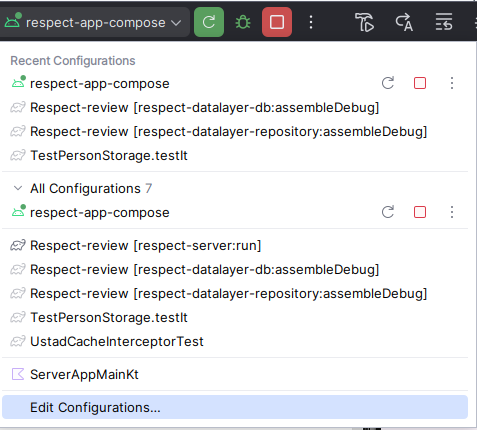
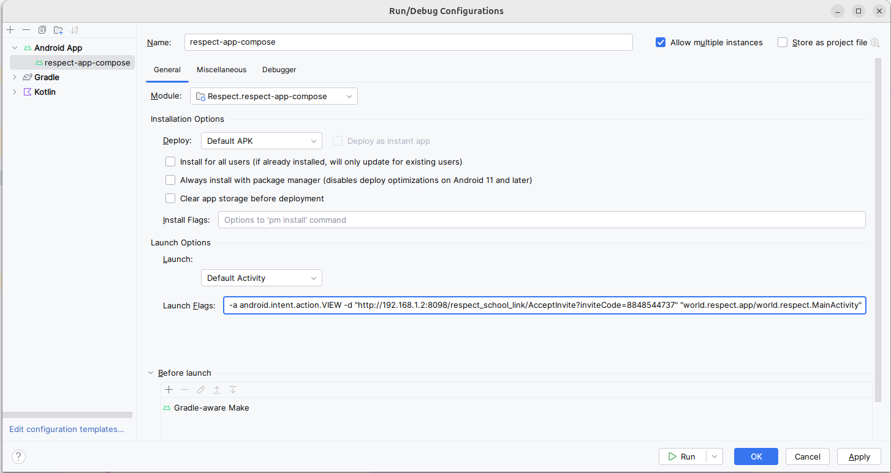

# RESPECT Jetpack Compose app

This is a [Compose Multiplatform](https://www.jetbrains.com/compose-multiplatform/) app. Currently
the app only targets Android and Desktop, and only the Andoid build is used.

```
adb shell cmd -w wifi set-wifi-enabled disabled
adb shell svc data disable
```

Passkey Gotcha's (thank you Google)
 
API call to get a yes/no answer for delegation authority by checking:
https://digitalassetlinks.googleapis.com/v1/assetlinks:check?source.web.site=https://localdev.ustadtesting.ustadmobile.com&relation=delegate_permission/common.get_login_creds&target.android_app.package_name=world.respect.app&target.android_app.certificate.sha256_fingerprint=6D:0E:03:2C:BA:4C:8D:BA:E3:1E:6E:C4:5D:E9:9B:AB:48:30:63:BC:2E:B1:00:DC:9F:6D:D3:A5:00:E2:70:3A

* Creation JSON MUST include a timeout, even though it is not required as per the spec.
* RPID cannot be validated: when using *.example.org in AndroidManifest and then using an rpId
  for a subdomain e.g. rpId=school.example.org, then https://school.example.org/.well-known/assetlinks.json 
  itself must return an HTTP 200 OK response (in addition to https://example.org/.well-known/assetlinks.json ). 


### Android link testing and debugging:

Android will only open http or https links in an app by default when they are [https verified app links](https://developer.android.com/training/app-links/create-deeplinks).
Those links must be declared in the Android manifest using intent filters.

When developing and testing, the server is typically running on the developer's laptop local IP
address.

It is possible to use Android Studio, ADB command line, or Maestro to start the RESPECT app using
a non-verified link the same as if the user had opened a verified app link (e.g. by clicking a link
on Chrome, messenger app, etc).

**Android Studio:**



Select edit configurations



Set the Launch Options launch flags e.g.

```
-a android.intent.action.VIEW -d "http://192.168.1.2:8098/respect_school_link/AcceptInvite?inviteCode=8848544737" "world.respect.app/world.respect.MainActivity"
```
Where the argument after -d is the link you want the app to open.

**ADB command line:**
```
adb shell am start -a android.intent.action.VIEW -d "http://192.168.1.2:8098/respect_school_link/AcceptInvite?inviteCode=8848544737" world.respect.app
```

**Maestro launchApp argument**:
```
- launchApp:
    appId: "world.respect.app"
    arguments: 
       launchUrl: "http://192.168.1.2:8098/respect_school_link/AcceptInvite?inviteCode=8848544737"
```
